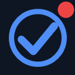
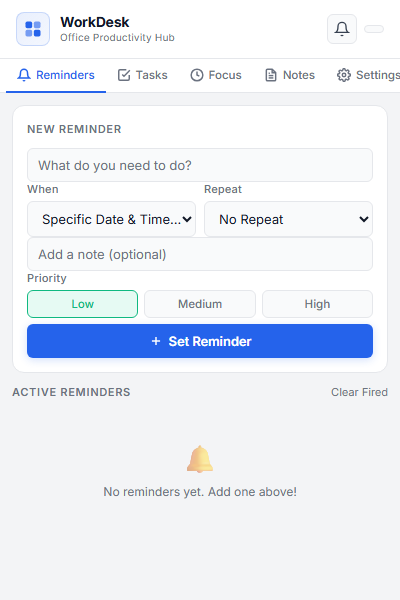
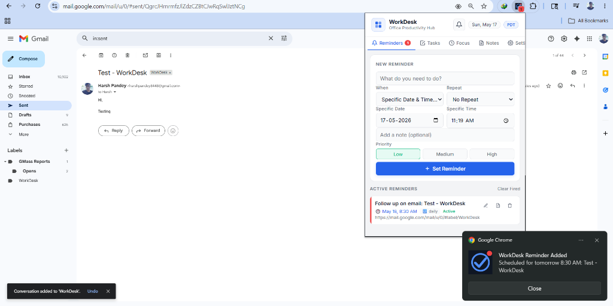
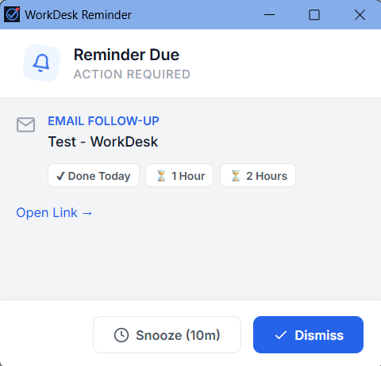
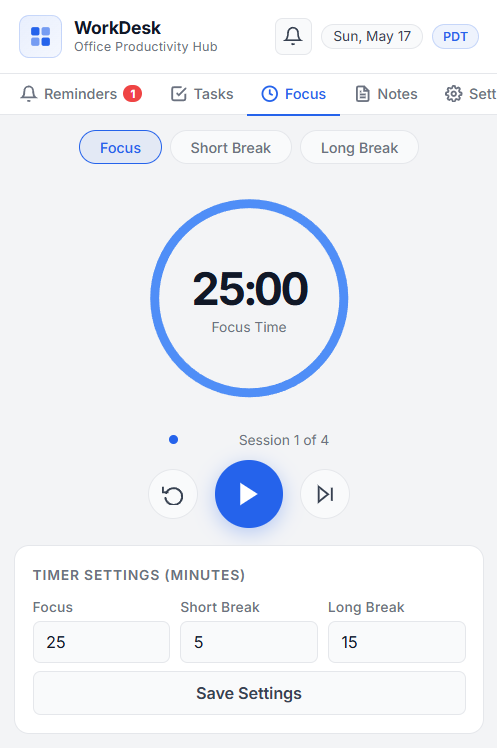
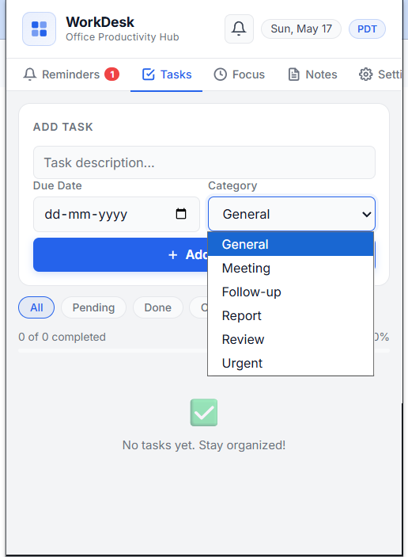
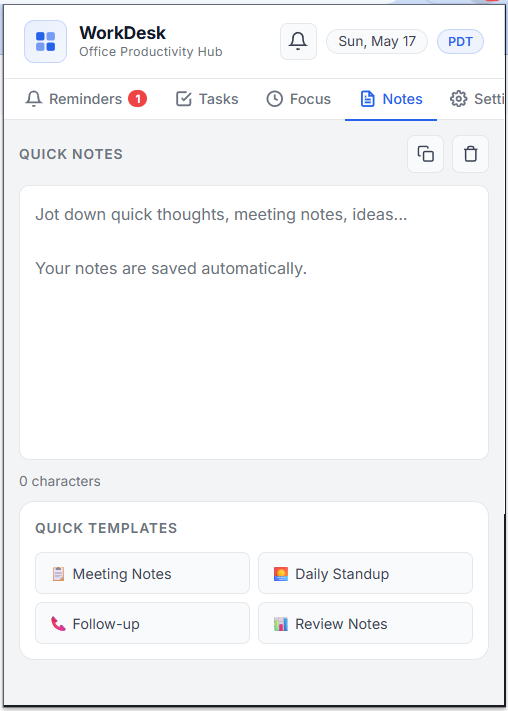
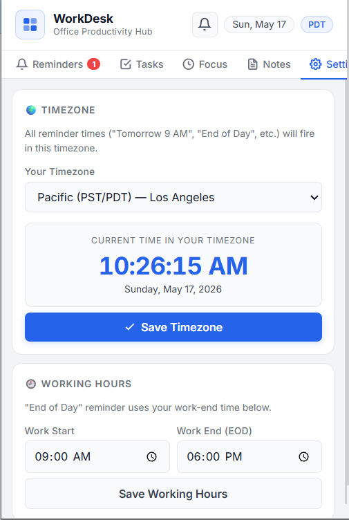

# WorkDesk: Enterprise Productivity Hub 🚀

**WorkDesk** is a premium, all-in-one Chrome extension designed for high-performance professionals. It transforms your browser into a centralized command center, combining ironclad Gmail automation with enterprise-grade task management.

---

## 📸 Screenshots

| Main Dashboard | Gmail Integration |
| :---: | :---: |
|  |  |
| **Smart Alarm Popup** | **Focus Timer** |
|  |  |
| **Task Manager** | **Quick Notes** |
|  |  |
| **Global Settings** | |
|  | |

---

## ✨ Key Features

### 📧 Intelligent Gmail Integration
*   **Auto-Sync via Labels**: Simply add the "WorkDesk" label to any email, and the tool instantly captures the subject and schedules a daily repeating follow-up.
*   **Auto-Cleanup**: Removing the label in Gmail automatically deletes the corresponding reminder in the extension.
*   **Subject Detection**: Smartly parses email headers and list-view data to ensure 100% accuracy in task naming.

### 🔔 Enterprise-Grade Notifications
*   **Sleek Alert System**: Replaces basic browser popups with a premium "Native App" experience.
*   **Bundle Logic**: If 20 tasks are due at once, you get one elegant list instead of 20 annoying windows.
*   **Smart Snooze**: One-click snooze for 10 minutes across all active alerts.

### ⏱️ Focused Productivity Tools
*   **Task Manager**: High, Medium, and Low priority task tracking with a clean, Inter-font based UI.
*   **Pomodoro Timer**: A built-in focus timer to help you work in deep-concentration sprints.
*   **Quick Notes**: A persistent scratchpad for capturing thoughts instantly without leaving your tab.

### 🎨 Design Aesthetic
*   **Enterprise Light Theme**: Built with a "Royal Blue" palette (`#2563eb`) and modern glassmorphism effects.
*   **Responsive Layout**: Optimized for high-density information display while maintaining a clean, breathable look.

---

## 🛠️ Installation Guide (Developer Mode)

Since this is a custom productivity tool, you can install it directly in your Chrome browser by following these steps:

1.  **Download the Code**: Clone this repository or download the ZIP file and extract it to a folder on your computer.
2.  **Open Extensions Page**: In Chrome, go to `chrome://extensions/` or click `Menu > Extensions > Manage Extensions`.
3.  **Enable Developer Mode**: Toggle the **"Developer mode"** switch in the top right corner.
4.  **Load Unpacked**: Click the **"Load unpacked"** button that appears.
5.  **Select Folder**: Select the folder where you extracted the WorkDesk files.
6.  **Pin It**: Click the "Puzzle" icon next to your address bar and pin **WorkDesk** for easy access!

---

## 📖 How to Use

### Managing Emails
1. Create a label in your Gmail called **"WorkDesk"**.
2. When you want to follow up on an email tomorrow at 8:30 AM, just apply the label.
3. The extension will automatically create a **Daily Repeating Reminder**. 
4. When you are done with the task, remove the label in Gmail or delete it in the extension.

### Using the Focus Timer
* Open the extension, go to the **Focus** tab, and click Start. The extension will track your sprint and notify you when it's time for a break.

---

## 💻 Tech Stack
*   **Core**: HTML5, CSS3 (Vanilla), JavaScript (ES6+)
*   **Storage**: Chrome Local Storage API
*   **Engine**: Chrome Alarms & Notifications API
*   **Architecture**: Manifest V3 (Latest Chrome standards)

---

## 🤝 About the Project

This project was developed as a hands-on learning experience to solve a real-world productivity problem. I acted as the product manager and system designer, conceptualizing features, managing the debugging process, and directing the overall architecture. 

To bring this vision to life, I collaborated with **Antigravity (Google DeepMind's AI Coding Assistant)**, acting as my pair programmer. While the AI handled the heavy lifting of writing the code, this collaboration allowed me to focus on UI/UX design, edge-case testing, and understanding the complex integration between Gmail's DOM and the Chrome Extension API.

---

## 📄 License
This project is open-source and available under the [MIT License](LICENSE).
